#Global GDP Data Tear Down (Part 1: Exploration)

This notebook is meant to be the first is a series meant to demonstrate model generation from a dataset by:

1. doing an initial exploration of the data (this notebook)
2. extracting patterns in the data using similarity measures
3. using machine learning to create a predictive model using this information

The specific types of features we'll be looking for are relationships between multiple countries. We can use this information to build up groupings of more countries by looking for mutually connected sets. 

First lets setup some utility functions for the rest of the notebook. Feel free to skip the next code block, hopefully the function names are descriptive enough to get what they're doing later.

    import numpy as np
    import matplotlib.pyplot as plt
    import pandas
    from pandas.tools.plotting import bootstrap_plot, scatter_matrix  # also autocorrelation_plot, andrews_curves, lag_plot
    #import mpld3
    #from geopy.distance import vincenty
    import json
    from pymongo import MongoClient
    from time import sleep
    import dateutil
    %pylab inline
    #mpld3.enable_notebook()
    
    #beautiful function from http://stackoverflow.com/questions/20618804/how-to-smooth-a-curve-in-th
    def smooth(y, box_pts=0):
      if box_pts==0:
        box_pts = np.ceil(y.__len__()*.01)
      box = np.ones(box_pts)/box_pts
      y_smooth = np.convolve(y, box, mode='same')
      return y_smooth
    
    def invert_colors(ax, grid=True):
        ax.patch.set_facecolor('black')
        if grid:
            ax.grid(color='w')
        return ax
    
    def random_sample(all, n):
        out = []
        all_len = all.__len__()
        for i in range(n):
            while True:
                rnd = np.random.randint(all_len)
                if all[rnd] not in out:
                    out.append(all[rnd])
                    break
        return out
    
    def random_hex_color():
        return '#'+(hex(np.random.randint(16**6))[2:])
    
    def calc_norm(x):
        #x is a pandas series object
        x_no_offset = x-x.copy().dropna().min()
        return x_no_offset/float(max(x_no_offset))
    
    def createMetric(f, norm_in=True, norm_out=True, trans_in=False):
        def outFunc(in_df, norm_in=norm_in, norm_out=norm_out):
            if trans_in:
                in_df = in_df.T
            if norm_in==True:
                in_df.apply(calc_norm,axis=1)
            out = pandas.DataFrame(columns=in_df.columns, index=in_df.columns)
            for i in out.columns:
                for j in out.columns:
                    #print(np.array(diff_gdp[i].fillna(0)))
                    out.ix[i,j] = f(in_df[i], in_df[j])
            out = out.apply(calc_norm, axis=1)
            return out
        return outFunc   
    
    def row_diff(in_df):
        return in_df.apply(lambda x: x.diff()/x, axis=0)
    
    def col_diff(in_df): 
        return row_diff(in_df.T).T
    
    def thresh(in_df, thresh):
        return in_df[in_df.abs().gt(thresh)]

    Populating the interactive namespace from numpy and matplotlib

## Initial Exploration
### Load the Data

Data will be downloaded from [Github Datasets](http://www.github.com/datasets/) where you can find a bunch of easily accessbile well formatted data sources for common things like population and [Gross Domestic Product](http://en.wikipedia.org/wiki/Gross_domestic_product) (GDP).
After loading the data, let us print the first few lines to check its structure.

    gdp = pandas.DataFrame.from_csv("https://raw.githubusercontent.com/datasets/gdp/master/data/gdp.csv")
    country_list = list(pandas.DataFrame.from_csv("https://raw.githubusercontent.com/datasets/country-codes/master/data/country-codes.csv")['ISO3166-1-Alpha-3'])
    pops = pandas.DataFrame.from_csv("https://raw.githubusercontent.com/datasets/population/master/data/population.csv")
    #next create weights for countries based on the percentage of the global population contained
    pops_weights = pops.pivot(
        index='Year',
        columns="Country Code",
        values="Value"
    ).apply(
        lambda x: x / x.WLD,
        axis = 1
    )
    gdp.rename(columns={"Value":"GDP"}, inplace=True)
    gdp['Country Name'] = gdp.index
    
    #save regional gdps seperately and remove from main variable
    regional_gdp = gdp.copy()[[(c not in country_list) & (c != 'WLD') for c in gdp['Country Code']]]
    world_gdp = gdp.copy()[gdp['Country Code']=="WLD"].pivot(index="Year", columns="Country Code", values= "GDP")
    world_gdp.rename(columns={'WLD':'GDP'})
    gdp = gdp[[c in country_list for c in gdp['Country Code']]]
    
    #add population column to gdp data
    gdp = gdp.merge(pops, on=['Country Code', 'Year'])
    gdp = gdp.rename(columns={'Value':'Population'})
    
    #world population
    wld_pops = pops[pops['Country Code']=='WLD']
    wld_pops.index = wld_pops.Year
    wld_pops = pandas.DataFrame(wld_pops['Value']).rename(columns={'WLD':'population'})
    world_gdp = world_gdp.merge(wld_pops, left_index=True, right_index=True)
    world_gdp = world_gdp.rename(columns={'Value':'Population'})
    
    #calc gdp per capita
    gdp['GDP per capita'] = gdp['GDP']/gdp['Population']
    #world_gdp['GDP per capita'] = world_gdp['GDP']/world_gdp['Population']
    
    gdp.head()

<table border="1" class="dataframe">
  <thead>
    <tr style="text-align: right;">
      <th></th>
      <th>Country Code</th>
      <th>Year</th>
      <th>GDP</th>
      <th>Country Name</th>
      <th>Population</th>
      <th>GDP per capita</th>
    </tr>
  </thead>
  <tbody>
    <tr>
      <th>0</th>
      <td>AFG</td>
      <td>1960</td>
      <td>5.377778e+08</td>
      <td>Afghanistan</td>
      <td>8774440</td>
      <td>61.289132</td>
    </tr>
    <tr>
      <th>1</th>
      <td>AFG</td>
      <td>1961</td>
      <td>5.488889e+08</td>
      <td>Afghanistan</td>
      <td>8953544</td>
      <td>61.304093</td>
    </tr>
    <tr>
      <th>2</th>
      <td>AFG</td>
      <td>1962</td>
      <td>5.466667e+08</td>
      <td>Afghanistan</td>
      <td>9141783</td>
      <td>59.798693</td>
    </tr>
    <tr>
      <th>3</th>
      <td>AFG</td>
      <td>1963</td>
      <td>7.511112e+08</td>
      <td>Afghanistan</td>
      <td>9339507</td>
      <td>80.423002</td>
    </tr>
    <tr>
      <th>4</th>
      <td>AFG</td>
      <td>1964</td>
      <td>8.000000e+08</td>
      <td>Afghanistan</td>
      <td>9547131</td>
      <td>83.794812</td>
    </tr>
  </tbody>
</table>

### Tabular Structure Check
To check if the data values we loaded make sense we can look at the ranges and other statistics for each column. As expected, count is the same for every column, since every column has 8080 entries. We can see we have data from 1960 to 2010 by the min and max of the Year column. We can also get a sense for the range of GDP, GDP per capita, and population.

    gdp.describe()

<table border="1" class="dataframe">
  <thead>
    <tr style="text-align: right;">
      <th></th>
      <th>Year</th>
      <th>GDP</th>
      <th>Population</th>
      <th>GDP per capita</th>
    </tr>
  </thead>
  <tbody>
    <tr>
      <th>count</th>
      <td>8759.000000</td>
      <td>8.759000e+03</td>
      <td>8.759000e+03</td>
      <td>8759.000000</td>
    </tr>
    <tr>
      <th>mean</th>
      <td>1990.065761</td>
      <td>1.487301e+11</td>
      <td>2.920497e+07</td>
      <td>6984.764591</td>
    </tr>
    <tr>
      <th>std</th>
      <td>15.300649</td>
      <td>7.827046e+11</td>
      <td>1.129357e+08</td>
      <td>14134.070935</td>
    </tr>
    <tr>
      <th>min</th>
      <td>1960.000000</td>
      <td>8.824746e+06</td>
      <td>9.004000e+03</td>
      <td>35.367728</td>
    </tr>
    <tr>
      <th>25%</th>
      <td>1978.000000</td>
      <td>1.153659e+09</td>
      <td>1.078783e+06</td>
      <td>448.919265</td>
    </tr>
    <tr>
      <th>50%</th>
      <td>1992.000000</td>
      <td>6.087003e+09</td>
      <td>5.241914e+06</td>
      <td>1535.988732</td>
    </tr>
    <tr>
      <th>75%</th>
      <td>2003.000000</td>
      <td>4.124583e+10</td>
      <td>1.615858e+07</td>
      <td>6333.649099</td>
    </tr>
    <tr>
      <th>max</th>
      <td>2014.000000</td>
      <td>1.741900e+13</td>
      <td>1.364270e+09</td>
      <td>193892.322258</td>
    </tr>
  </tbody>
</table>

    startYear = int(gdp.describe().ix['min','Year'])
    endYear = int(gdp.describe().ix['max','Year'])

Let's check a few top 10's

    print('Top 10 GDP '+str(endYear))
    gdp[gdp['Year']==endYear].sort('GDP', ascending=False).head(10)

    Top 10 GDP 2014

<table border="1" class="dataframe">
  <thead>
    <tr style="text-align: right;">
      <th></th>
      <th>Country Code</th>
      <th>Year</th>
      <th>GDP</th>
      <th>Country Name</th>
      <th>Population</th>
      <th>GDP per capita</th>
    </tr>
  </thead>
  <tbody>
    <tr>
      <th>8369</th>
      <td>USA</td>
      <td>2014</td>
      <td>1.741900e+13</td>
      <td>United States</td>
      <td>318857056</td>
      <td>54629.495168</td>
    </tr>
    <tr>
      <th>1727</th>
      <td>CHN</td>
      <td>2014</td>
      <td>1.036011e+13</td>
      <td>China</td>
      <td>1364270000</td>
      <td>7593.881891</td>
    </tr>
    <tr>
      <th>4076</th>
      <td>JPN</td>
      <td>2014</td>
      <td>4.601461e+12</td>
      <td>Japan</td>
      <td>127131800</td>
      <td>36194.415613</td>
    </tr>
    <tr>
      <th>3014</th>
      <td>DEU</td>
      <td>2014</td>
      <td>3.852556e+12</td>
      <td>Germany</td>
      <td>80889505</td>
      <td>47627.392078</td>
    </tr>
    <tr>
      <th>8314</th>
      <td>GBR</td>
      <td>2014</td>
      <td>2.941886e+12</td>
      <td>United Kingdom</td>
      <td>64510376</td>
      <td>45603.292367</td>
    </tr>
    <tr>
      <th>2804</th>
      <td>FRA</td>
      <td>2014</td>
      <td>2.829192e+12</td>
      <td>France</td>
      <td>66201365</td>
      <td>42736.158675</td>
    </tr>
    <tr>
      <th>1128</th>
      <td>BRA</td>
      <td>2014</td>
      <td>2.346118e+12</td>
      <td>Brazil</td>
      <td>202033670</td>
      <td>11612.510802</td>
    </tr>
    <tr>
      <th>3967</th>
      <td>ITA</td>
      <td>2014</td>
      <td>2.144338e+12</td>
      <td>Italy</td>
      <td>61336387</td>
      <td>34960.295021</td>
    </tr>
    <tr>
      <th>3654</th>
      <td>IND</td>
      <td>2014</td>
      <td>2.066902e+12</td>
      <td>India</td>
      <td>1267401849</td>
      <td>1630.818512</td>
    </tr>
    <tr>
      <th>6559</th>
      <td>RUS</td>
      <td>2014</td>
      <td>1.860598e+12</td>
      <td>Russian Federation</td>
      <td>143819569</td>
      <td>12937.028915</td>
    </tr>
  </tbody>
</table>

    print('Top 10 GDP per capita '+str(endYear))
    gdp[gdp['Year']==endYear].sort('GDP per capita', ascending=False).head(10)

    Top 10 GDP per capita 2014

<table border="1" class="dataframe">
  <thead>
    <tr style="text-align: right;">
      <th></th>
      <th>Country Code</th>
      <th>Year</th>
      <th>GDP</th>
      <th>Country Name</th>
      <th>Population</th>
      <th>GDP per capita</th>
    </tr>
  </thead>
  <tbody>
    <tr>
      <th>5922</th>
      <td>NOR</td>
      <td>2014</td>
      <td>5.001031e+11</td>
      <td>Norway</td>
      <td>5136475</td>
      <td>97363.093254</td>
    </tr>
    <tr>
      <th>4731</th>
      <td>MAC</td>
      <td>2014</td>
      <td>5.550153e+10</td>
      <td>Macao SAR, China</td>
      <td>575481</td>
      <td>96443.727122</td>
    </tr>
    <tr>
      <th>6505</th>
      <td>QAT</td>
      <td>2014</td>
      <td>2.118168e+11</td>
      <td>Qatar</td>
      <td>2267916</td>
      <td>93397.091533</td>
    </tr>
    <tr>
      <th>384</th>
      <td>AUS</td>
      <td>2014</td>
      <td>1.453770e+12</td>
      <td>Australia</td>
      <td>23490736</td>
      <td>61886.958785</td>
    </tr>
    <tr>
      <th>2218</th>
      <td>DNK</td>
      <td>2014</td>
      <td>3.419516e+11</td>
      <td>Denmark</td>
      <td>5639565</td>
      <td>60634.394272</td>
    </tr>
    <tr>
      <th>7617</th>
      <td>SWE</td>
      <td>2014</td>
      <td>5.705913e+11</td>
      <td>Sweden</td>
      <td>9689555</td>
      <td>58887.251908</td>
    </tr>
    <tr>
      <th>6957</th>
      <td>SGP</td>
      <td>2014</td>
      <td>3.078719e+11</td>
      <td>Singapore</td>
      <td>5469700</td>
      <td>56286.799493</td>
    </tr>
    <tr>
      <th>8369</th>
      <td>USA</td>
      <td>2014</td>
      <td>1.741900e+13</td>
      <td>United States</td>
      <td>318857056</td>
      <td>54629.495168</td>
    </tr>
    <tr>
      <th>3844</th>
      <td>IRL</td>
      <td>2014</td>
      <td>2.459207e+11</td>
      <td>Ireland</td>
      <td>4612719</td>
      <td>53313.612374</td>
    </tr>
    <tr>
      <th>3599</th>
      <td>ISL</td>
      <td>2014</td>
      <td>1.707100e+10</td>
      <td>Iceland</td>
      <td>327589</td>
      <td>52111.043103</td>
    </tr>
  </tbody>
</table>

    print('Top 10 GDP All Time')
    gdp.sort('GDP', ascending=False).head(10)

    Top 10 GDP All Time

<table border="1" class="dataframe">
  <thead>
    <tr style="text-align: right;">
      <th></th>
      <th>Country Code</th>
      <th>Year</th>
      <th>GDP</th>
      <th>Country Name</th>
      <th>Population</th>
      <th>GDP per capita</th>
    </tr>
  </thead>
  <tbody>
    <tr>
      <th>8369</th>
      <td>USA</td>
      <td>2014</td>
      <td>1.741900e+13</td>
      <td>United States</td>
      <td>318857056</td>
      <td>54629.495168</td>
    </tr>
    <tr>
      <th>8368</th>
      <td>USA</td>
      <td>2013</td>
      <td>1.676805e+13</td>
      <td>United States</td>
      <td>316497531</td>
      <td>52980.043626</td>
    </tr>
    <tr>
      <th>8367</th>
      <td>USA</td>
      <td>2012</td>
      <td>1.616316e+13</td>
      <td>United States</td>
      <td>314112078</td>
      <td>51456.658728</td>
    </tr>
    <tr>
      <th>8366</th>
      <td>USA</td>
      <td>2011</td>
      <td>1.551793e+13</td>
      <td>United States</td>
      <td>311721632</td>
      <td>49781.357490</td>
    </tr>
    <tr>
      <th>8365</th>
      <td>USA</td>
      <td>2010</td>
      <td>1.496437e+13</td>
      <td>United States</td>
      <td>309347057</td>
      <td>48374.056457</td>
    </tr>
    <tr>
      <th>8363</th>
      <td>USA</td>
      <td>2008</td>
      <td>1.471858e+13</td>
      <td>United States</td>
      <td>304093966</td>
      <td>48401.427340</td>
    </tr>
    <tr>
      <th>8362</th>
      <td>USA</td>
      <td>2007</td>
      <td>1.447764e+13</td>
      <td>United States</td>
      <td>301231207</td>
      <td>48061.537661</td>
    </tr>
    <tr>
      <th>8364</th>
      <td>USA</td>
      <td>2009</td>
      <td>1.441874e+13</td>
      <td>United States</td>
      <td>306771529</td>
      <td>47001.555350</td>
    </tr>
    <tr>
      <th>8361</th>
      <td>USA</td>
      <td>2006</td>
      <td>1.385589e+13</td>
      <td>United States</td>
      <td>298379912</td>
      <td>46437.067117</td>
    </tr>
    <tr>
      <th>8360</th>
      <td>USA</td>
      <td>2005</td>
      <td>1.309373e+13</td>
      <td>United States</td>
      <td>295516599</td>
      <td>44307.920585</td>
    </tr>
  </tbody>
</table>

    print('Top 10 GDP per capita All Time')
    gdp.sort('GDP per capita', ascending=False).head(10)

    Top 10 GDP per capita All Time

<table border="1" class="dataframe">
  <thead>
    <tr style="text-align: right;">
      <th></th>
      <th>Country Code</th>
      <th>Year</th>
      <th>GDP</th>
      <th>Country Name</th>
      <th>Population</th>
      <th>GDP per capita</th>
    </tr>
  </thead>
  <tbody>
    <tr>
      <th>5323</th>
      <td>MCO</td>
      <td>2008</td>
      <td>6.919241e+09</td>
      <td>Monaco</td>
      <td>35686</td>
      <td>193892.322258</td>
    </tr>
    <tr>
      <th>5322</th>
      <td>MCO</td>
      <td>2007</td>
      <td>5.974372e+09</td>
      <td>Monaco</td>
      <td>35013</td>
      <td>170632.956215</td>
    </tr>
    <tr>
      <th>5326</th>
      <td>MCO</td>
      <td>2011</td>
      <td>6.074884e+09</td>
      <td>Monaco</td>
      <td>37261</td>
      <td>163035.999801</td>
    </tr>
    <tr>
      <th>4632</th>
      <td>LIE</td>
      <td>2011</td>
      <td>5.739706e+09</td>
      <td>Liechtenstein</td>
      <td>36388</td>
      <td>157736.226846</td>
    </tr>
    <tr>
      <th>5324</th>
      <td>MCO</td>
      <td>2009</td>
      <td>5.557245e+09</td>
      <td>Monaco</td>
      <td>36314</td>
      <td>153033.131088</td>
    </tr>
    <tr>
      <th>4633</th>
      <td>LIE</td>
      <td>2012</td>
      <td>5.487773e+09</td>
      <td>Liechtenstein</td>
      <td>36656</td>
      <td>149710.100732</td>
    </tr>
    <tr>
      <th>5325</th>
      <td>MCO</td>
      <td>2010</td>
      <td>5.350675e+09</td>
      <td>Monaco</td>
      <td>36845</td>
      <td>145221.191568</td>
    </tr>
    <tr>
      <th>4629</th>
      <td>LIE</td>
      <td>2008</td>
      <td>5.081480e+09</td>
      <td>Liechtenstein</td>
      <td>35582</td>
      <td>142810.405264</td>
    </tr>
    <tr>
      <th>4631</th>
      <td>LIE</td>
      <td>2010</td>
      <td>5.082339e+09</td>
      <td>Liechtenstein</td>
      <td>36120</td>
      <td>140707.058828</td>
    </tr>
    <tr>
      <th>5321</th>
      <td>MCO</td>
      <td>2006</td>
      <td>4.663488e+09</td>
      <td>Monaco</td>
      <td>34369</td>
      <td>135688.799881</td>
    </tr>
  </tbody>
</table>

### High-level View of Data
Tables are a great way to quickly check the integrity of your data and do simple queries, but to build models we need to understand how all the datapoints relate to each other. By discovering and extracting structure across countries, we can normalize the data, producing a clean training set for model generation in a later notebook.

These next charts have a lot going on, so let us look at what is there. For each of these charts a 50 member sample is taken from the data 500 times, with the mean, median, and midrange calculated on each group. Because the number of members per sample is small compared to the size of the full dataset, the mean of a set of samples will vary according to the full probability distribution.

    bootstrap_plot?

    #TODO fix figure size and title
    fs = (15,15)
    f = bootstrap_plot(gdp['GDP'], size=50, samples=500, color='grey');
    f.suptitle("Distributions for GDP")
    f = bootstrap_plot(gdp['GDP per capita'], size=50,samples=500, color='grey');
    f.suptitle("Distributions for GDP per Capita")

    <matplotlib.text.Text at 0x7f07cbf60b70>

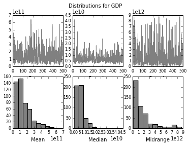

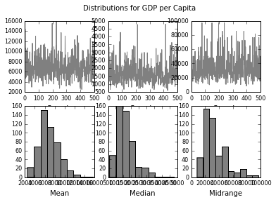

We have 4 numerical columns in our data (GDP, Population, GDP Per Capita, and Year) and there could potentially be interesting patterns and correlations between any set of these variables.

Below we look at all pairs of of these values on a scatter chart. There are patterns and correlations visable in every one of these graphs, but the type of relationship is not always clear and often may rely on more than the two variables shown. Since time probably plays a role in almost every relationship shown, we could try to treat time differently in our graphs such as by creating animations or using color. Hans Rosling has made some interesting animations of global scale time series in this [TED Talk by Hans Rosling](http://www.ted.com/talks/hans_rosling_shows_the_best_stats_you_ve_ever_seen?language=en) I highly recommend. His excitement level alone is inspiring.

Instead lets graph each pair of variables as axis of a scatter graph. The numbers probably won't tell you as much as the shapes in this next one.

    fig = plt.figure()
    scatter_matrix(gdp, figsize=(10,10), alpha=0.078, diagonal="kde");
    fig;

    <matplotlib.figure.Figure at 0x7f081078d438>

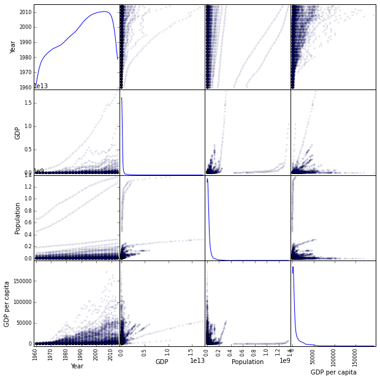

It is the graph above showing GDP per capita versus time that has the most complex and interesting set of patterns we're goin to model in the rest of this analysis. In theory, this graph contains information relating to global production per person, which is a factor of effiency, something worth optimizing.

**Philosophical Motivation:**
I do not believe wealth to be a complete measure of value in this world, 
but I do know that it a measurable one, and therefor potentially a signal that can be modelled and used to better society. Proving techniques like this should motivate investigations into how we can measure other types of value in the world so that they may be better similarly understood. In the future I believe we will measure empathy and stress like we do oil barrel prices today.

## The Whole World

    world_gdp.head()

<table border="1" class="dataframe">
  <thead>
    <tr style="text-align: right;">
      <th>Country Code</th>
      <th>WLD</th>
      <th>Population</th>
    </tr>
    <tr>
      <th>Year</th>
      <th></th>
      <th></th>
    </tr>
  </thead>
  <tbody>
    <tr>
      <th>1960</th>
      <td>1.368215e+12</td>
      <td>3036527378</td>
    </tr>
    <tr>
      <th>1961</th>
      <td>1.423602e+12</td>
      <td>3077623700</td>
    </tr>
    <tr>
      <th>1962</th>
      <td>1.528570e+12</td>
      <td>3130555779</td>
    </tr>
    <tr>
      <th>1963</th>
      <td>1.644637e+12</td>
      <td>3195412654</td>
    </tr>
    <tr>
      <th>1964</th>
      <td>1.802221e+12</td>
      <td>3260817678</td>
    </tr>
  </tbody>
</table>

    ax = world_gdp.plot(legend=False, title="World GDP");
    #ax.patch.set_facecolor('black')

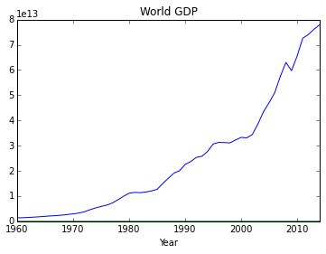

The graph below shows all the world's country's GDPs. Each series/line is a different country. While the large number of lines make it impossible to pick out individual countries (also the reason why a legend was not included), this chart lets us do a high-level view of the data and gives us a sense of the net motion of collection.

    fs = (12,8) #figure size
    #lg = False
    lgy = True
    gdp_by_country = gdp.pivot(index="Year", columns="Country Name", values = "GDP")
    #ax = gdp_by_country.plot(logy=lgy, legend=False, figsize=fs, alpha=.4, title='All the GDPs')
    ax = invert_colors(ax, grid=False)
    gdp_pc_by_country = gdp.pivot(index="Year", columns="Country Name", values = "GDP per capita")
    ax = gdp_pc_by_country.plot(logy=lgy, legend=False, figsize=fs, alpha=.4, title="All the GDP per capita's")
    ax = invert_colors(ax, grid=False)

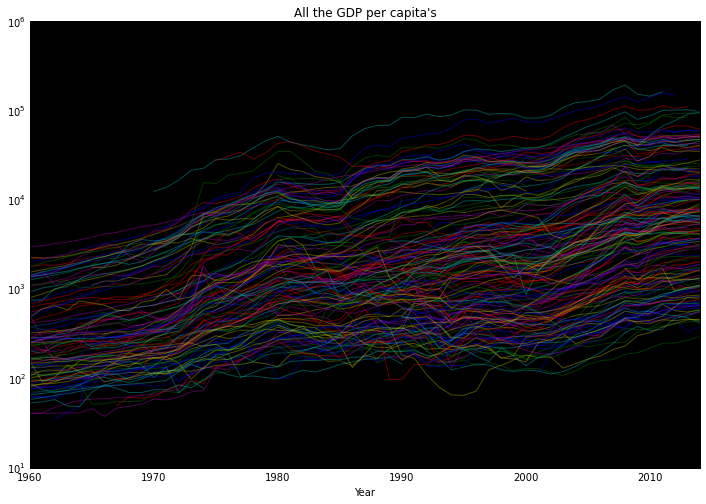

Note the data look linear on a logarithmic scale. Using a logarithmic scale causes the size of motion in a signal to be proportional to its size.
Let us dive deeper...

The wide range of values for GDP per capita in the graph above make it hard to tell what group motion looks like. Let us shift and scale each country's data to be between 0 and 1. If we see simultaneous changes across groups of countries, we should suspect some relationship exists to link these countries. If we can isolate those relationships, we may be able to make some meaningful predictions based upon them.

    fs = (15,15) #figure size
    counter = 0
    leg = False #legend
    lgy = True
    al = .3 #alpha
    gdp_by_country_norm = gdp_by_country.apply(calc_norm)
    gdp_pc_by_country_norm = gdp_pc_by_country.apply(calc_norm)
    #ax = gdp_by_country_norm.plot(legend=leg, logy=lgy, style=st, figsize=fs, alpha=al, title="Normalized GDP by Country")
    ax = invert_colors(ax, grid=False)
    ax = gdp_pc_by_country_norm.plot(
        legend=leg,
        #logy=lgy,
        figsize=fs, alpha=al, title="Normalized GDP per capita by Country");
    ax = invert_colors(ax, grid=False)
    counter+=1

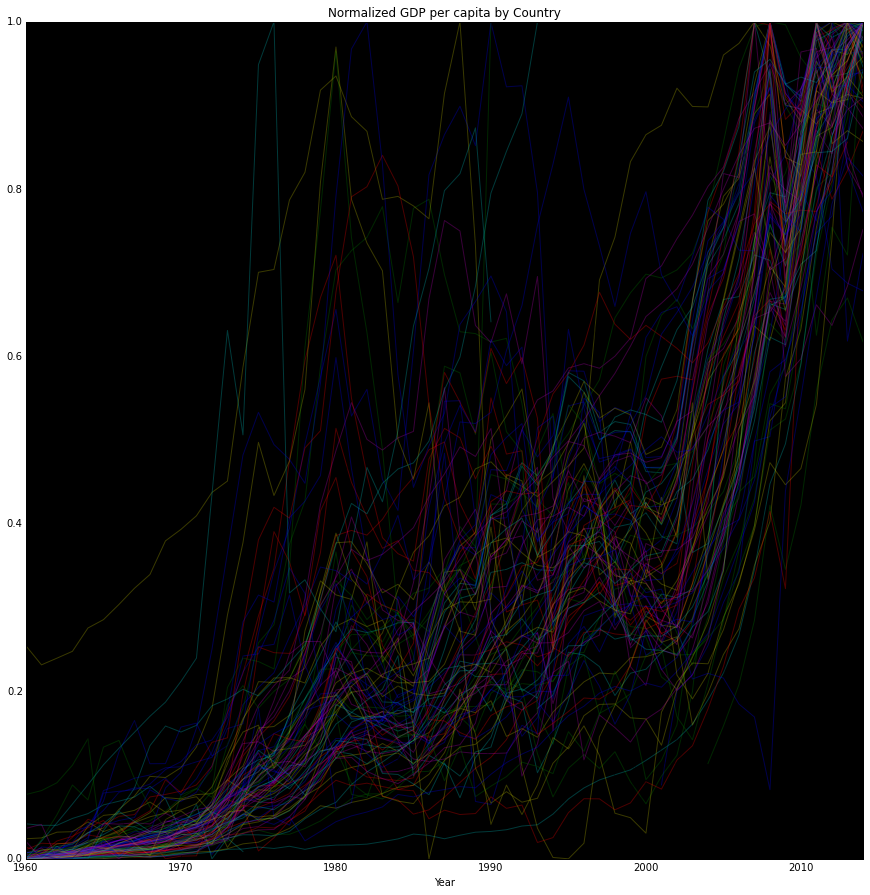

The brighter region containing most of the countries indicates this data contains a signal comprised of individual countries and more importantly relationships and interactions between countries.

## Rate of Change

In this section we will look at how GDP values grow and contract over time. Countries sharing growth patterns may be experiencing similar conditions and forces impacting their change in output. Obviously the range of these forces may be extremely varied (just speculating: known abundence of natural resources, trade relations, etc.). First we look at the change in gdp from year to year. Then let us look at some graphs of the same data.

    diff_gdp = gdp_pc_by_country.apply(lambda x: x.diff()/x, axis=0)
    diff_gdp.dropna()
    #diff_gdp.plot(kind="kde")
    diff_gdp.tail()

<table border="1" class="dataframe">
  <thead>
    <tr style="text-align: right;">
      <th>Country Name</th>
      <th>Afghanistan</th>
      <th>Albania</th>
      <th>Algeria</th>
      <th>Andorra</th>
      <th>Angola</th>
      <th>Antigua and Barbuda</th>
      <th>Argentina</th>
      <th>Armenia</th>
      <th>Aruba</th>
      <th>Australia</th>
      <th>...</th>
      <th>Uruguay</th>
      <th>Uzbekistan</th>
      <th>Vanuatu</th>
      <th>Venezuela, RB</th>
      <th>Vietnam</th>
      <th>Virgin Islands (U.S.)</th>
      <th>West Bank and Gaza</th>
      <th>Yemen, Rep.</th>
      <th>Zambia</th>
      <th>Zimbabwe</th>
    </tr>
    <tr>
      <th>Year</th>
      <th></th>
      <th></th>
      <th></th>
      <th></th>
      <th></th>
      <th></th>
      <th></th>
      <th></th>
      <th></th>
      <th></th>
      <th></th>
      <th></th>
      <th></th>
      <th></th>
      <th></th>
      <th></th>
      <th></th>
      <th></th>
      <th></th>
      <th></th>
      <th></th>
    </tr>
  </thead>
  <tbody>
    <tr>
      <th>2010</th>
      <td>0.196970</td>
      <td>-0.004830</td>
      <td>0.132957</td>
      <td>-0.080283</td>
      <td>0.054512</td>
      <td>-0.073898</td>
      <td>0.175052</td>
      <td>0.067592</td>
      <td>-0.014442</td>
      <td>0.175650</td>
      <td>...</td>
      <td>0.211365</td>
      <td>0.141774</td>
      <td>0.108849</td>
      <td>0.150020</td>
      <td>0.075896</td>
      <td>NaN</td>
      <td>0.160566</td>
      <td>0.057087</td>
      <td>0.220510</td>
      <td>0.124853</td>
    </tr>
    <tr>
      <th>2011</th>
      <td>0.089028</td>
      <td>0.077392</td>
      <td>0.174904</td>
      <td>0.024137</td>
      <td>0.182311</td>
      <td>-0.015562</td>
      <td>0.166011</td>
      <td>0.086755</td>
      <td>0.042029</td>
      <td>0.166296</td>
      <td>...</td>
      <td>0.157217</td>
      <td>0.108585</td>
      <td>0.094801</td>
      <td>-0.263902</td>
      <td>0.135735</td>
      <td>NaN</td>
      <td>0.122416</td>
      <td>-0.018106</td>
      <td>0.119127</td>
      <td>0.118258</td>
    </tr>
    <tr>
      <th>2012</th>
      <td>0.105341</td>
      <td>-0.042715</td>
      <td>0.007200</td>
      <td>-0.096258</td>
      <td>0.068697</td>
      <td>0.052328</td>
      <td>0.070657</td>
      <td>-0.020205</td>
      <td>NaN</td>
      <td>0.079663</td>
      <td>...</td>
      <td>0.063339</td>
      <td>0.101341</td>
      <td>-0.036350</td>
      <td>0.157183</td>
      <td>0.120915</td>
      <td>NaN</td>
      <td>0.043850</td>
      <td>0.008256</td>
      <td>0.017620</td>
      <td>0.097524</td>
    </tr>
    <tr>
      <th>2013</th>
      <td>-0.035762</td>
      <td>0.045324</td>
      <td>0.009491</td>
      <td>0.021075</td>
      <td>0.041998</td>
      <td>-0.013756</td>
      <td>0.014519</td>
      <td>0.042969</td>
      <td>NaN</td>
      <td>-0.000575</td>
      <td>...</td>
      <td>0.103644</td>
      <td>0.084628</td>
      <td>0.003360</td>
      <td>-0.042234</td>
      <td>0.080358</td>
      <td>NaN</td>
      <td>0.068522</td>
      <td>0.087151</td>
      <td>0.039527</td>
      <td>0.046795</td>
    </tr>
    <tr>
      <th>2014</th>
      <td>0.002233</td>
      <td>0.034884</td>
      <td>0.000075</td>
      <td>NaN</td>
      <td>0.025786</td>
      <td>0.044347</td>
      <td>-0.161454</td>
      <td>0.038999</td>
      <td>NaN</td>
      <td>-0.090263</td>
      <td>...</td>
      <td>-0.004346</td>
      <td>0.078390</td>
      <td>NaN</td>
      <td>0.261153</td>
      <td>0.069997</td>
      <td>NaN</td>
      <td>-0.008867</td>
      <td>NaN</td>
      <td>-0.023810</td>
      <td>-0.018709</td>
    </tr>
  </tbody>
</table>

5 rows × 204 columns

    wld_gdp_pc = world_gdp.WLD/world_gdp.Population
    diff_wrd_gdp = wld_gdp_pc.diff()/wld_gdp_pc
    ax = diff_wrd_gdp.ix[range(1960,2014)].plot(legend=False, style='.-', title="Year over year global change in GDP")
    #ax = diff_gdp.ix[range(1960,2014)].sum(axis=1).plot(legend=False, style='.', title="Year over year global change in GDP")
    ax.set_ylabel('Percent')
    #ax = invert_colors(ax)

    <matplotlib.text.Text at 0x7f07d2dda160>

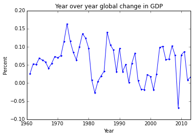

    diff_gdp_perc_of_wld = gdp_pc_by_country.fillna(method='backfill').apply(
        (lambda x: x.diff()), axis=0
    )
    diff_gdp_perc_of_wld['WLD'] = wld_gdp_pc
    diff_gdp_perc_of_wld.apply(lambda x: x/diff_gdp_perc_of_wld['WLD'])
    
    #.join(wld_gdp_pc, on="Year")
            #/wld_gdp_pc#.diff()
    diff_gdp_perc_of_wld['WLD'].head(100);

    ax = diff_gdp.ix[range(startYear,endYear)].plot(kind='line', style='-', alpha=0.1, figsize=(15,20), ylim=(-4, 1), legend=False, title="Year over year change in GDP per capita (second derivative)")
    ax = invert_colors(ax, grid=False)
    ax.set_ylabel("Percent")
    #savefig('test.png', bbox_inches='tight')

    <matplotlib.text.Text at 0x7f07d2daee48>

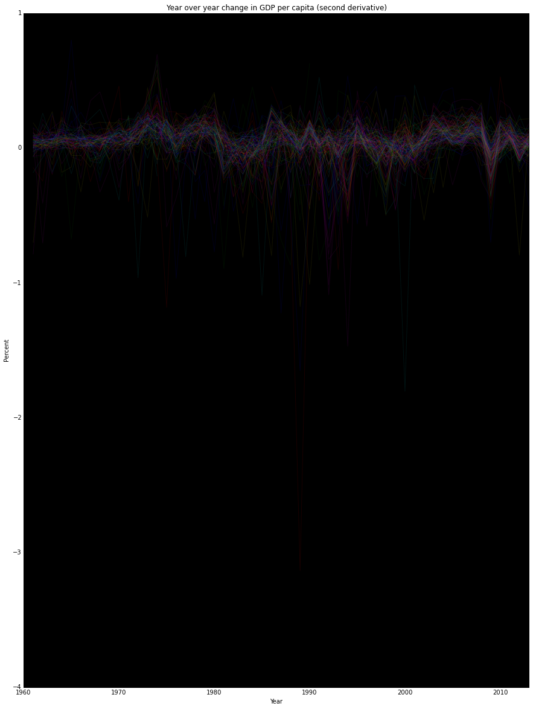

    #same graph as last cell but different ylims
    ax = diff_gdp.ix[range(startYear,endYear)].plot(kind='line', style='-', alpha=0.1, figsize=(15,10), ylim=(-1, 1), legend=False, title="Year over year change in GDP per capita")
    ax = invert_colors(ax, grid=False)
    ax.set_ylabel("Percent")
    #savefig('test.png', bbox_inches='tight')

    <matplotlib.text.Text at 0x7f07d8581048>

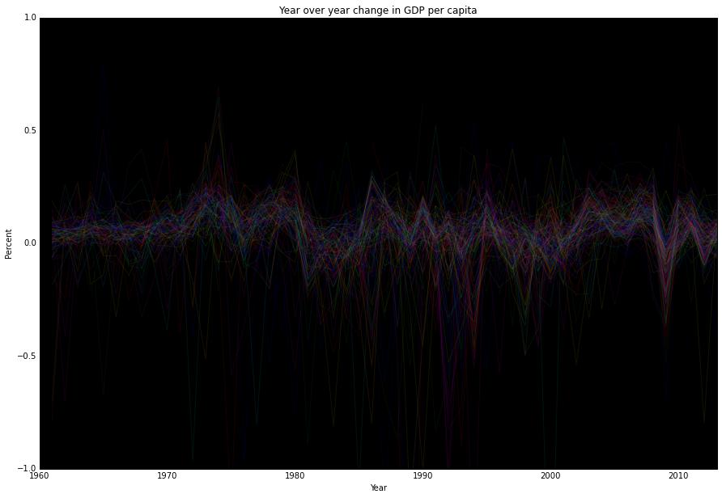

    #same graph as last cell but different xlims
    ax = diff_gdp.ix[range(2000,endYear)].plot(kind='line', style='-', alpha=0.1, figsize=(15,10), ylim=(-1, 1), legend=False, title="Year over year change in GDP per capita, 2000-2014")
    ax = invert_colors(ax, grid=False)
    ax.set_ylabel("Percent")
    #savefig('test.png', bbox_inches='tight')

    <matplotlib.text.Text at 0x7f07d8933e48>

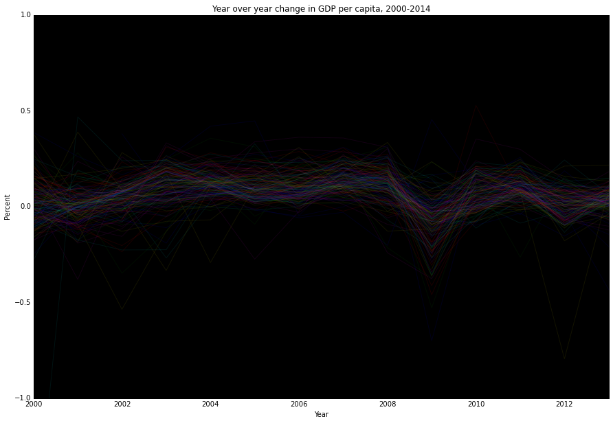

I love seeing the whole world moving together like that. Let's talk a little about how this view of the data could be interpreted. A year over year change is  GDP per Capita

So obviously there is some group motion here, but we want to isolate the relationships between countries, so global gdp motion needs to be normalized out, like so:

    #should we normalize based upon a population weighted mean? probably worth checking out
    #same graph as last cell but with mean line drawn
    ax = diff_gdp.ix[range(startYear,endYear)].plot(kind='line', style='--b', alpha=0.1, figsize=(15,10), ylim=(-.3,.3), legend=False, title="Year over year change in GDP per capita")
    ax = world_gdp.ix[range(startYear,endYear)]['WLD'].plot(kind='line', ax = ax, style='-', linewidth=5, alpha=1, legend=False, title="Year over year change in GDP per capita (mean line in BOLD)")
    ax = diff_gdp.ix[range(startYear,endYear)].apply(lambda x: smooth(x, box_pts=3), axis=0).mean(weights=pops_weights, axis=1).plot(kind='line', ax = ax, style='-g', alpha=.8, linewidth=5, ylim=(-.3,.3), legend=False, title="Year over year change in GDP per capita (mean line in BOLD)")
    ax = diff_gdp.ix[range(startYear,endYear)].mean(weights=pops_weights, axis=1).plot(kind='line', ax = ax, style='-r', alpha =.8, linewidth=5, ylim=(-.3,.3), legend=False, title="Year over year change in GDP per capita (mean line in black, smoothed mean in green)")
    ax = invert_colors(ax, grid=True)
    ax.set_ylabel("Percent")
    #savefig('test.png', bbox_inches='tight')

    <matplotlib.text.Text at 0x7f07d8448208>

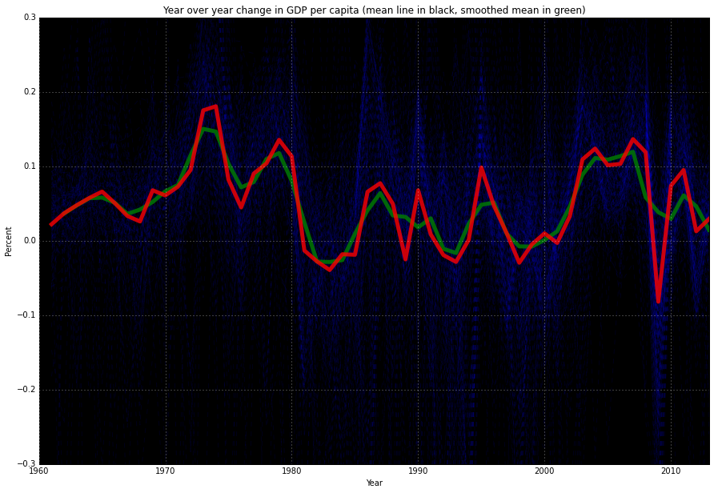

    #Remove trend line
    #TODO: calc mean based on a windowed outlier reduction
    timeRange = range(startYear,endYear)
    means = diff_gdp.copy().mean(weights=pops_weights, axis=1)
    stripped_diff_gdp = diff_gdp.ix[timeRange].copy().apply(lambda x: x - means)
    
    ax = stripped_diff_gdp.ix[range(startYear,endYear)].plot(kind='line', style='-', alpha=0.1, figsize=(15,15), ylim=(-.25,.25), legend=False, title="Mean normalized year over year change in GDP per capita")
    #ax = stripped_diff_gdp.ix[range(startYear,endYear)].mean(axis=1).plot(kind='line', ax = ax, style='-', linewidth=5, alpha=1, ylim=(-.5,.5), legend=False)
    ax = invert_colors(ax, grid=False)
    ax.set_ylabel("Percent Deviation from Mean")
    #savefig('test.png', bbox_inches='tight')

    <matplotlib.text.Text at 0x7f07d0f3f3c8>

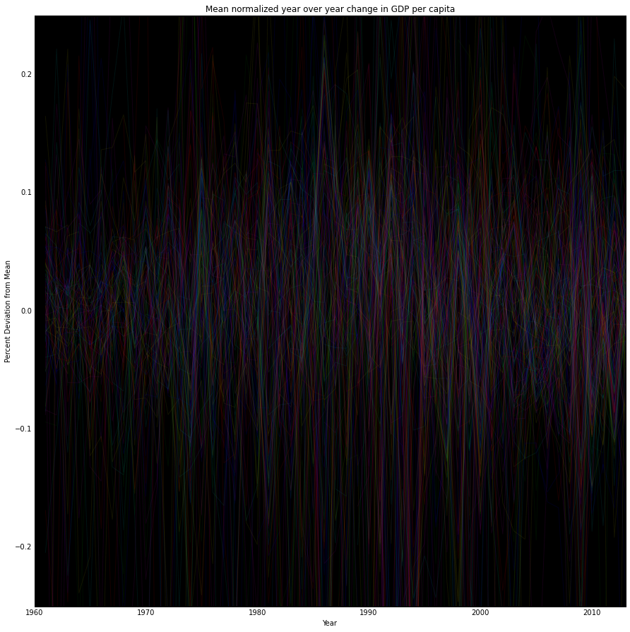

    smooth_means = diff_gdp.apply(lambda x: smooth(x, box_pts=3), axis=0).mean(weights=pops_weights, axis=1)
    
    smooth_stripped_diff_gdp = diff_gdp.ix[timeRange].copy().apply(lambda x: x - smooth_means)
    
    ax = smooth_stripped_diff_gdp.ix[range(startYear,endYear)].plot(kind='line', style='-', alpha=0.1, figsize=(15,15), fontsize=30, ylim=(-.25,.25), legend=False, title="Smoothed Mean normalized year over year change in GDP per capita")
    #ax = smooth_stripped_diff_gdp.ix[range(startYear,endYear)].mean(axis=1).plot(kind='line', ax = ax, style='-', linewidth=5, alpha=1, ylim=(-.5,.5), legend=False)
    ax = invert_colors(ax, grid=False)
    ax.set_ylabel("Percent Deviation from Smoothed Mean")

    <matplotlib.text.Text at 0x7f07d0bef828>

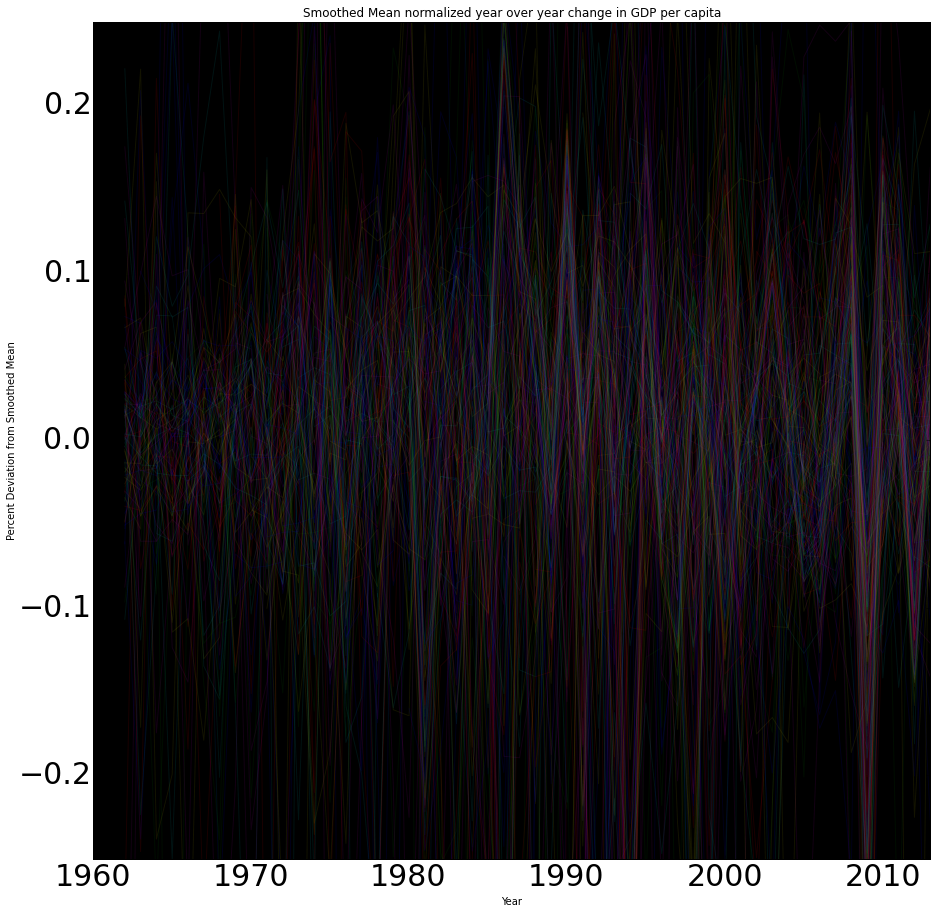

#Sneak peak at relationships

    ecorr_stripped_diff_gdp = pandas.stats.moments.ewmcorr(stripped_diff_gdp, span=10)

    df = ecorr_stripped_diff_gdp[2014]
    df_copy = df.copy()
    for i in df.index:
        df_copy.ix[i,i]=0
    #ax = invert_colors(ax, grid=False)

    #see who's most like a United States
    ecorr_stripped_diff_gdp.ix[endYear, 'United States'].dropna().sort(inplace=False, ascending=False).head()

    Country Name
    United States       1.000000
    Belize              0.927895
    Puerto Rico         0.919640
    Bahamas, The        0.906554
    Marshall Islands    0.893691
    Name: United States, dtype: float64

    #see who's most like South Africa
    ecorr_stripped_diff_gdp.ix[endYear, 'South Africa'].dropna().sort(inplace=False, ascending=False).head()

    Country Name
    South Africa    1.000000
    Lesotho         0.956945
    Namibia         0.910636
    Swaziland       0.864109
    Botswana        0.756710
    Name: South Africa, dtype: float64

    #see who's most like Ukraine
    ecorr_stripped_diff_gdp.ix[endYear, 'Ukraine'].dropna().sort(inplace=False, ascending=False).head()

    Country Name
    Ukraine               1.000000
    Somalia               0.989238
    Russian Federation    0.899185
    Kazakhstan            0.859621
    Iraq                  0.835740
    Name: Ukraine, dtype: float64

    ecorr_stripped_diff_gdp.to_frame(False).head()

<table border="1" class="dataframe">
  <thead>
    <tr style="text-align: right;">
      <th></th>
      <th>Year</th>
      <th>1960</th>
      <th>1961</th>
      <th>1962</th>
      <th>1963</th>
      <th>1964</th>
      <th>1965</th>
      <th>1966</th>
      <th>1967</th>
      <th>1968</th>
      <th>1969</th>
      <th>...</th>
      <th>2005</th>
      <th>2006</th>
      <th>2007</th>
      <th>2008</th>
      <th>2009</th>
      <th>2010</th>
      <th>2011</th>
      <th>2012</th>
      <th>2013</th>
      <th>2014</th>
    </tr>
    <tr>
      <th>Country Name</th>
      <th>Country Name</th>
      <th></th>
      <th></th>
      <th></th>
      <th></th>
      <th></th>
      <th></th>
      <th></th>
      <th></th>
      <th></th>
      <th></th>
      <th></th>
      <th></th>
      <th></th>
      <th></th>
      <th></th>
      <th></th>
      <th></th>
      <th></th>
      <th></th>
      <th></th>
      <th></th>
    </tr>
  </thead>
  <tbody>
    <tr>
      <th rowspan="5" valign="top">Afghanistan</th>
      <th>Afghanistan</th>
      <td>NaN</td>
      <td>NaN</td>
      <td>1</td>
      <td>1.000000</td>
      <td>1.000000</td>
      <td>1.000000</td>
      <td>1.000000</td>
      <td>1.000000</td>
      <td>1.000000</td>
      <td>1.000000</td>
      <td>...</td>
      <td>1.000000</td>
      <td>1.000000</td>
      <td>1.000000</td>
      <td>1.000000</td>
      <td>1.000000</td>
      <td>1.000000</td>
      <td>1.000000</td>
      <td>1.000000</td>
      <td>1.000000</td>
      <td>1.000000</td>
    </tr>
    <tr>
      <th>Albania</th>
      <td>NaN</td>
      <td>NaN</td>
      <td>NaN</td>
      <td>NaN</td>
      <td>NaN</td>
      <td>NaN</td>
      <td>NaN</td>
      <td>NaN</td>
      <td>NaN</td>
      <td>NaN</td>
      <td>...</td>
      <td>-0.370129</td>
      <td>-0.068082</td>
      <td>-0.154546</td>
      <td>-0.231881</td>
      <td>-0.329290</td>
      <td>-0.330588</td>
      <td>-0.242299</td>
      <td>-0.265602</td>
      <td>-0.318576</td>
      <td>-0.318576</td>
    </tr>
    <tr>
      <th>Algeria</th>
      <td>NaN</td>
      <td>NaN</td>
      <td>1</td>
      <td>0.996489</td>
      <td>0.889513</td>
      <td>0.844063</td>
      <td>0.487595</td>
      <td>0.477106</td>
      <td>-0.131165</td>
      <td>-0.136606</td>
      <td>...</td>
      <td>-0.883922</td>
      <td>-0.473747</td>
      <td>-0.571189</td>
      <td>-0.726422</td>
      <td>-0.813787</td>
      <td>-0.696866</td>
      <td>-0.727192</td>
      <td>-0.730681</td>
      <td>-0.544709</td>
      <td>-0.544709</td>
    </tr>
    <tr>
      <th>Andorra</th>
      <td>NaN</td>
      <td>NaN</td>
      <td>NaN</td>
      <td>NaN</td>
      <td>NaN</td>
      <td>NaN</td>
      <td>NaN</td>
      <td>NaN</td>
      <td>NaN</td>
      <td>NaN</td>
      <td>...</td>
      <td>-0.010666</td>
      <td>0.131163</td>
      <td>0.024563</td>
      <td>0.448190</td>
      <td>0.430891</td>
      <td>0.151994</td>
      <td>0.189997</td>
      <td>0.135508</td>
      <td>-0.049657</td>
      <td>-0.049657</td>
    </tr>
    <tr>
      <th>Angola</th>
      <td>NaN</td>
      <td>NaN</td>
      <td>NaN</td>
      <td>NaN</td>
      <td>NaN</td>
      <td>NaN</td>
      <td>NaN</td>
      <td>NaN</td>
      <td>NaN</td>
      <td>NaN</td>
      <td>...</td>
      <td>0.667706</td>
      <td>0.486178</td>
      <td>0.452001</td>
      <td>0.408136</td>
      <td>-0.424015</td>
      <td>-0.450376</td>
      <td>-0.449564</td>
      <td>-0.455153</td>
      <td>-0.235841</td>
      <td>-0.235841</td>
    </tr>
  </tbody>
</table>

5 rows × 55 columns

    #prep stripped_diff_gdp
    stripped_diff_gdp_T = stripped_diff_gdp.copy().T
    diff_gdp_T = diff_gdp.copy().T
    gdp_means = pandas.DataFrame(means, columns=["global mean (each country=1) gdp percent change"])
    gdp_smoothed_means = pandas.DataFrame(smooth_means, columns=["global smoothed "])

    #save things to mongo
    things_to_save = ['diff_gdp_T','stripped_diff_gdp_T','diff_gdp','stripped_diff_gdp','smooth_stripped_diff_gdp','gdp_means']
    db = MongoClient('mongodb').meteor
    col_base = 'analysis.gdp.exploratory.'
    for t in things_to_save:
        df = eval(t).copy()
        def stringify(a):
            return [str(c).replace('.','') for c in a]
        df.index = stringify(df.index)
        df.columns = stringify(df.columns)
        d = df.to_dict()
        col = eval('db.'+col_base+t)
        col.drop()
        col.insert_one(d)

    col.find_one()

    {'_id': ObjectId('56188081b07c0e005a596637'),
     'global mean (each country=1) gdp percent change': {'1960': nan,
      '1961': 0.022123087200703422,
      '1962': 0.036992634214059524,
      '1963': 0.04781444736943552,
      '1964': 0.05760222554889485,
      '1965': 0.06606097922641889,
      '1966': 0.05065176754299532,
      '1967': 0.03328580398925803,
      '1968': 0.02589346819713049,
      '1969': 0.0677940886656857,
      '1970': 0.06088880441045978,
      '1971': 0.07265438249396669,
      '1972': 0.09516132428069536,
      '1973': 0.17518315532712508,
      '1974': 0.1806672912110676,
      '1975': 0.08187931052142129,
      '1976': 0.04474873501006319,
      '1977': 0.0902815522739931,
      '1978': 0.1038674729253257,
      '1979': 0.13556672379720838,
      '1980': 0.11339667152162106,
      '1981': -0.01309560025733634,
      '1982': -0.027796373741084113,
      '1983': -0.03933583422339953,
      '1984': -0.018160203260748766,
      '1985': -0.018828951301604696,
      '1986': 0.06580203169537263,
      '1987': 0.07728841038579566,
      '1988': 0.049623535695782366,
      '1989': -0.025054721515258786,
      '1990': 0.06776083342451386,
      '1991': 0.008561905552825117,
      '1992': -0.01926301908020394,
      '1993': -0.028443721404271722,
      '1994': 0.0010372270347130922,
      '1995': 0.09849952774780393,
      '1996': 0.04683506324749495,
      '1997': 0.010255635424636271,
      '1998': -0.029530351598873565,
      '1999': -0.004884573042341655,
      '2000': 0.009955447095219158,
      '2001': -0.002921373048923057,
      '2002': 0.03292535447598746,
      '2003': 0.10923117638807268,
      '2004': 0.12381496501133317,
      '2005': 0.1014950134451168,
      '2006': 0.10321204513260405,
      '2007': 0.13654426175037832,
      '2008': 0.11896657553850785,
      '2009': -0.08192475378069769,
      '2010': 0.0739035456735281,
      '2011': 0.09500763637006257,
      '2012': 0.012726736449899271,
      '2013': 0.029140579286811876,
      '2014': 0.011652679056621415}}

